## Network Routing

```mermaid
flowchart TB

%% Hardware
rpi("Raspberry Pi 4🍓") 

ice("Intel NUC")

mint("Ryzen 9 🎞 🎶")

router("Router ↔")

internet("ISP 🌐")

subgraph Router
	router
end

subgraph Raspberry Pi 4
	rpi <-- cat5e --> router
	
	subgraph apps_pi
		Pi-Hole 
		PiVPN
		Home_Assistant 
	end
end

subgraph Intel NUC
	ice <-- cat5e --> router

	subgraph apps_nuc
		Nginx_Proxy_Manager
		Nextcloud 
		Vaultwarden 
	end
end

subgraph Ryzen 9 
	mint <-- cat5e --> router

	subgraph apps_ryzen_9
		plex.tv 
		jellyfin 
		game_emulation
	end
end


router <-- fiber 400mbps --> internet


```

## Pi4 (Debian 11 Bullseye 64bit)
- [Glances](/vault/%F0%9F%93%81developer/Home__Lab__%F0%9F%8F%A0/Glances.md)
- [Pi-hole](/vault/%F0%9F%93%81developer/Home__Lab__%F0%9F%8F%A0/Pi-hole.md)
	- Unbound DNS
	- DHCP list
- [PiVPN](/vault/%F0%9F%93%81developer/Home__Lab__%F0%9F%8F%A0/PiVPN.md)
	- .config files for each client
- [DuckDNS](/vault/%F0%9F%93%81developer/Home__Lab__%F0%9F%8F%A0/DuckDNS.md)
- [Home Assistant](/vault/%F0%9F%93%81developer/Home__Lab__%F0%9F%8F%A0/Home__Assistant.md)
- [Hyperion](/vault/%F0%9F%93%81developer/Home__Lab__%F0%9F%8F%A0/Hyperion.md)

---
## Icicle - Intel NUC (Debian 11 Bullseye 64bit)
- [Glances](/vault/%F0%9F%93%81developer/Home__Lab__%F0%9F%8F%A0/Glances.md)
- [Duplicati](/vault/%F0%9F%93%81developer/Home__Lab__%F0%9F%8F%A0/Duplicati.md)
- [SFTP](/vault/%F0%9F%93%81developer/Home__Lab__%F0%9F%8F%A0/SFTP.md)
- [Docker](/vault/%F0%9F%93%81developer/Home__Lab__%F0%9F%8F%A0/Docker.md)
	- [Nextcloud](/vault/%F0%9F%93%81developer/Home__Lab__%F0%9F%8F%A0/Nextcloud.md)
	- [Nginx Proxy Manager](/vault/%F0%9F%93%81developer/Home__Lab__%F0%9F%8F%A0/Nginx__Proxy__Manager.md)
	- [Nginx Proxy Manager](/vault/%F0%9F%93%81developer/Home__Lab__%F0%9F%8F%A0/Nginx__Proxy__Manager.md)
	- [vaultwarden](/vault/%F0%9F%93%81developer/Home__Lab__%F0%9F%8F%A0/vaultwarden.md)
	- [Wordpress](/vault/%F0%9F%93%81developer/Home__Lab__%F0%9F%8F%A0/Wordpress.md)
	- [ReactJS](/vault/%F0%9F%93%81developer/Home__Lab__%F0%9F%8F%A0/ReactJS.md)
	- [NextJS](/vault/%F0%9F%93%81developer/Home__Lab__%F0%9F%8F%A0/NextJS.md)
	- [portainer](/vault/%F0%9F%93%81developer/Home__Lab__%F0%9F%8F%A0/portainer.md)

---
## Spearmint - (custom PC) (Linux Mint)
- [Glances](/vault/%F0%9F%93%81developer/Home__Lab__%F0%9F%8F%A0/Glances.md)
- [Duplicati](/vault/%F0%9F%93%81developer/Home__Lab__%F0%9F%8F%A0/Duplicati.md)
- [Docker](/vault/%F0%9F%93%81developer/Home__Lab__%F0%9F%8F%A0/Docker.md)
	- [Plex.tv](/vault/%F0%9F%93%81developer/Home__Lab__%F0%9F%8F%A0/Plex.tv.md)
	- [Jellyfin](/vault/%F0%9F%93%81developer/Home__Lab__%F0%9F%8F%A0/Jellyfin.md)
	- [portainer](/vault/%F0%9F%93%81developer/Home__Lab__%F0%9F%8F%A0/portainer.md)
- [XMRig](/vault/%F0%9F%93%81developer/Home__Lab__%F0%9F%8F%A0/XMRig.md)
- [SAMBA](/vault/%F0%9F%93%81developer/Home__Lab__%F0%9F%8F%A0/SAMBA.md)

---
## Frostbyte
- [Duplicati](/vault/%F0%9F%93%81developer/Home__Lab__%F0%9F%8F%A0/Duplicati.md) 
- FL Studio
- Davinci Resolve
- Unity3D
- Steam, Epic Games, Battle.net
- [Thunderbird — Make Email Easier. — Thunderbird](/vault/https://www.thunderbird.net/en-US/)

---
## Sn0flake
- [Duplicati](/vault/%F0%9F%93%81developer/Home__Lab__%F0%9F%8F%A0/Duplicati.md)
- Serato
- [Hyperion](/vault/%F0%9F%93%81developer/Home__Lab__%F0%9F%8F%A0/Hyperion.md)
- Unity3D

---
## Milkywave
- [Nextcloud](/vault/%F0%9F%93%81developer/Home__Lab__%F0%9F%8F%A0/Nextcloud.md)
- [SAMBA](/vault/%F0%9F%93%81developer/Home__Lab__%F0%9F%8F%A0/SAMBA.md)
- [K-9 Mail (k9mail.app)](/vault/k9mail.app)))

---
#todo
- [ ] Pi4 - backup-dd-n-shrink.sh
- [ ] Zip instead of pi-shrink
- [ ] Pi4 - backup.sh
- [ ] Add hyperion into the mix
- [ ] tryout jellyfin in home assistant integration 

[Obsidian Publish with NextJS](/vault/%F0%9F%93%81developer/Projects%F0%9F%93%90/Obsidian__Publish__with__NextJS.md)
[Nginx Proxy Manager](/vault/%F0%9F%93%81developer/Home__Lab__%F0%9F%8F%A0/Nginx__Proxy__Manager.md)
[Melt & Murder](/vault/%F0%9F%93%81music/split_skream/Melt__&__Murder.md)
