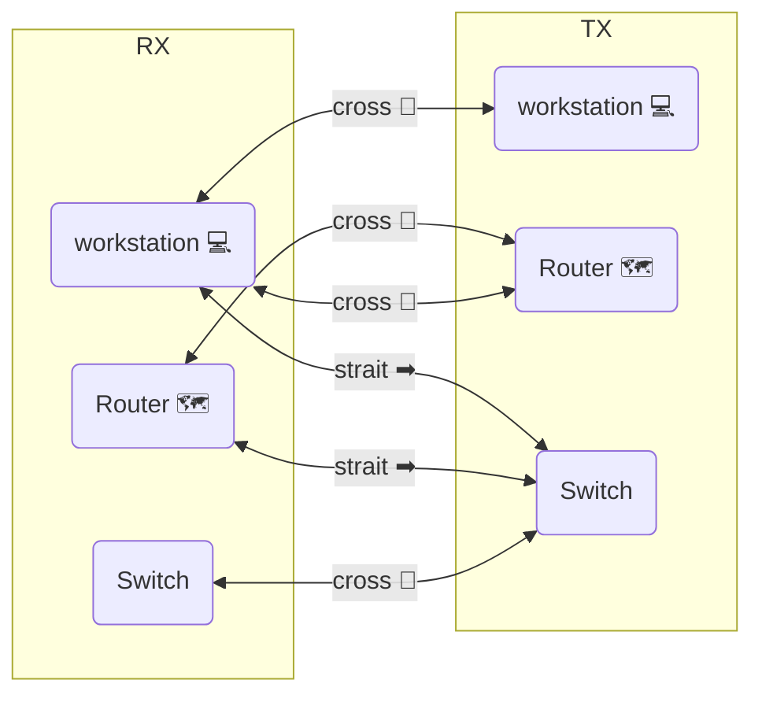

### Straight-Through
- patch cables
- most common ethernet cable
- connect workstations to network

### Cross-Over cable

### straight-through or crossover
| problem                    | cable type         |
| -------------------------- | ------------------ |
| Workstation -> Switch      | straight-through ➡ |
| router -> switch           | straight-through ➡ |
| switch to switch           | crossover 🔀       |
| router to router           | crossover 🔀       |
| workstation to workstation | crossover 🔀       |
| workstation to router      | crossover 🔀       | 

#### pretty mermaid graph visual
